[English](README.md) | 中文 

# NeonIO简介
NeonIO是一款支持容器化部署的企业级分布式块存储系统，能够给Kubernetes平台上提供动态创建（dynamic provisioning)持久存储卷（persistent volume)的能力,支持clone、snapshot、resstore、resize等功能。

## 架构图
 
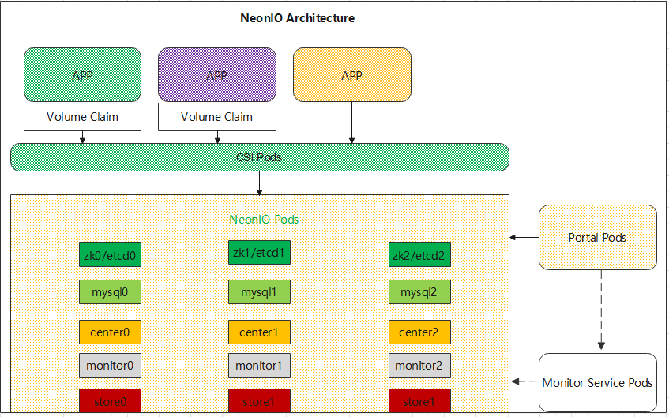

zk/etcd: 提供集群发现、分布式协调、选master等服务

mysql：提供元数据存储服务，如PV存储卷的元数据

center：提供逻辑管理服务，如创建PV卷，快照

monitor: 提供监控服务，能够把采集监控指标暴露给Promethus

store：存储服务，处理应用IO的功能

portal：提供UI界面服务

CSI：提供csi的标准IO接入服务


# 安装
## 前置条件 
1. Kubernetes已经成功部署，可按照Kubernetes的官网部署。

2. 集群的每个节点都已安装QBD，如未安装，用如下命令安装。

    centos OS系列：`rpm -ivh pitrix-dep-qbd-2.1.2-1dkms.noarch.rpm pitrix-dep-qbd-util-2.1.2-1.el8.x86_64.rpm`

    ubuntu OS系列：`dpkg -i pitrix-dep-qbd-2.1.2-1dkms.noarch.rpm pitrix-dep-qbd-util-2.1.2-1.el8.x86_64.rpm`

3. Kubernetes集群的每个节点都加载了qbd和qbd_tcp模块

    `lsmod | egrep -i qbd`

    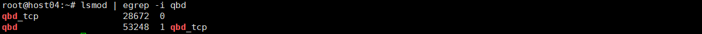

    如未加载，可在节点上运行如下命令加载

    `modprobe qbd && modprobe qbd_tcp`

    **提示：可在每个节点上编辑以下文件，开机自动加载qbd所需模块,编辑/etc/rc.local写入:**


    ```
    modprobe qbd
    modprobe qbd_tcp 
    ```

4. Kubernetes集群的master节点已经安装了Helm

    `helm version`

    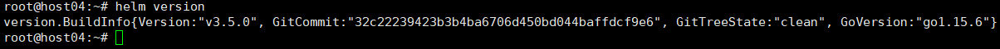


## 检查是否已经安装

登陆Kubernetes集群的master节点，运行如下命令，如果输出为空，表示NeonIO未安装，如果输出结果类似下方，则表示NeonIO已经安装。

`kubectl get pod -A | grep neon`


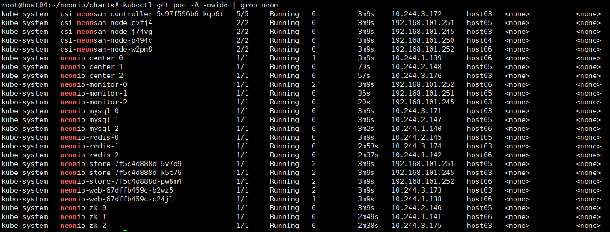


## 安装
1. 运行如下命令下载Helm安装包:

    ```
    git clone  https://github.com/qingstor/neonio.git
    cd neonio/charts/
    ```
2. 部署节点的规划

    2.1 登录集群的master节点，执行命令如下查询k8s集群的节点

    `kubectl get node -o wide`

    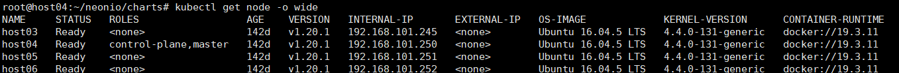

    2.2 例如把host03、host05、host06部署neonio-store，则把三节点标记为store
    ```
    kubectl label nodes host03 neonio/store=store
    kubectl label nodes host05 neonio/store=store
    kubectl label nodes host06 neonio/store=store
    ```  
    **部署neonio-store服务的节点至少有一个原始设备（无分区或格式化文件系统）给neonio单独使用，如下命令回显，sdb是一个原始设备，可以给neonio使用**
    
    ```
    root@host03:~# lsblk -f
    NAME                  FSTYPE      LABEL                           UUID                                   MOUNTPOINT
    sda                                                                                                      
    ├─sda1                ext2                                        38869881-aa97-4bf5-8b39-668f739b2ede   /boot
    ├─sda2                                                                                                   
    └─sda5                LVM2_member                                 dsDtd3-9Aeg-4r1t-EiL6-xUgb-zhpC-MHeTWP 
      ├─host01--vg-root   ext4                                        0e031537-f01b-49b0-a282-3722cfa25056   /
      └─host01--vg-swap_1 swap                                        80b1f62c-1c2b-44b1-a0b7-83d58ea8652b   
        └─cryptswap1      swap                                        ad07281a-51c7-4919-aee8-3bc60194fdec   
    sdb                                                                                                      
    sr0                   iso9660     Ubuntu-Server 16.04.5 LTS amd64 2018-07-31-00-39-29-00                 

    ```

    2.3 例如部署zookeeper的节点为host03、host05、host06，部署mysql的节点为host03、host05、host06，则把三节点分别打label
    ```
    # 执行如下命令host03、host05、host06标记为zk
    kubectl label nodes host03 neonio/zk=zk
    kubectl label nodes host05 neonio/zk=zk
    kubectl label nodes host06 neonio/zk=zk
    ```
    ```
    # 执行如下命令host03、host05、host06标记为mysql
    kubectl label nodes host03 neonio/mysql=mysql
    kubectl label nodes host05 neonio/mysql=mysql
    kubectl label nodes host06 neonio/mysql=mysql
    ```

3. 安装NeonIO

    3.1 安装NeonIO，默认是需要3节点，如果不满足参考《修改安装参数》章节
    
    `helm install neonio ./neonio --namespace kube-system`

    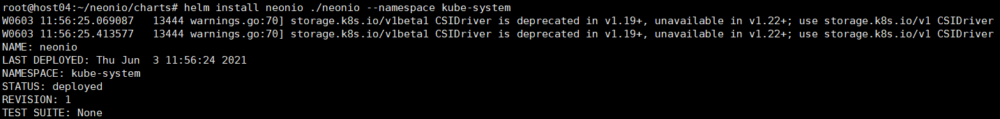


    3.2 用如下命令查看，等到都read都OK了为止

    `kubectl get pod -A | grep neon`

    

    3.3 检查集群状态 
    
    `kubectl -n kube-system exec neonio-center-0 -- neonsan list_center`

    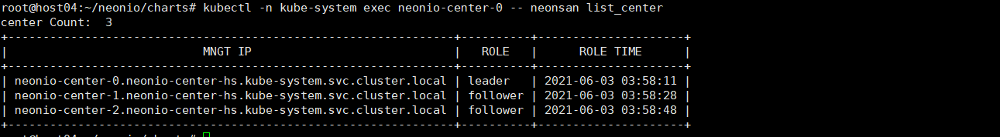

    `kubectl -n kube-system exec neonio-center-0 -- neonsan list_store`

    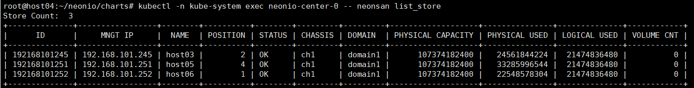

    `kubectl -n kube-system exec neonio-center-0 -- neonsan list_ssd`

    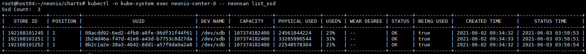

    3.4 创建pool
    
    `kubectl -n kube-system  exec neonio-center-0 -- neonsan create_pool --pool kube`

    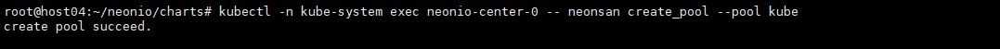


    3.5 创建rg
    
    `kubectl -n kube-system  exec neonio-center-0 -- neonsan create_rg --rg rg_name`

    

    3.6 把节点store节点加入到到rg，**store_id需要根据实际情况修改**
    
    `kubectl -n kube-system  exec neonio-center-0 -- neonsan add_rg_node --rg rg_name --store_id 192168101245,192168101251,192168101252`

    
    


# 测试NeonIO

如下示例，创建一个yaml文件
```
cat busybox-test.yaml
kind: PersistentVolumeClaim
apiVersion: v1
metadata:
  name: neonsan-test-pvc
spec:
  storageClassName: csi-neonsan
  accessModes:
    - ReadWriteOnce
  resources:
    requests:
      storage: 10Gi
---
apiVersion: v1
kind: Pod
metadata:
  name: busybox-test
spec:
  containers:
    - name: busybox
      imagePullPolicy: IfNotPresent
      image: busybox:latest
      command: [ "/bin/sh", "-c", "tail -f /dev/null" ]
      volumeMounts:
      - name: volume1
        mountPath: "/mnt/volume1"
  volumes:
  - name: volume1
    persistentVolumeClaim:
      claimName: neonsan-test-pvc
  restartPolicy: Never


# 应用yaml，创建pvc和busybox应用
$ kubectl apply -f busybox-test.yaml
persistentvolumeclaim/neonsan-test-pvc created
pod/busybox-test created

# 查看pvc，状态应为Bound
$ kubectl get pvc
NAME                                   STATUS   VOLUME                                     CAPACITY   ACCESS MODES   STORAGECLASS           AGE
neonsan-test-pvc                       Bound    pvc-5ef6436c-95f6-470f-9e4e-ad705457fb0f   10Gi       RWO            csi-neonsan            4s

# 查看busybox pod，状态应为Running
$ kubectl get pod
NAME                                READY   STATUS      RESTARTS   AGE
busybox-test                        1/1     Running     0          11s

# 进入busybox pod，向存储卷里写入数据
$ kubectl exec busybox-test -t -- sh -c 'echo hello > /mnt/volume1/test.log'
# 进入busybox pod，读取存储卷里的数据
$ kubectl exec busybox-test -t -- sh -c 'cat /mnt/volume1/test.log'
hello

# 删除pvc和busybox pod
$ kubectl delete -f busybox-test.yaml
persistentvolumeclaim "neonsan-test-pvc" deleted
pod "busybox-test" deleted
```


# 登录portal
1. 查看portal映射出来的端口

    `kubectl get svc  -A |grep neonio-web`

    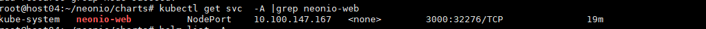

2. 通过浏览器登录portal：http://k8s_master_ip:32276，用户名/密码：admin@qingstore.com/zhu88jie

    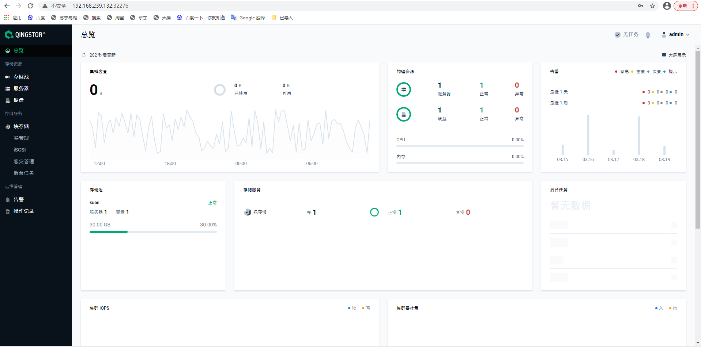

# 更改安装参数

使用helm install安装NeonIO时，可按需更改某些默认参数，查看所有参数和默认值: `helm show values ./neonio`


- 例如更改storageclass的存储池名称为"neonsan", 卷副本数为3，center的个数为2

    `helm install neonio ./neonio  --namespace kube-system --set sc.pool_name=neonsan --set sc.rep_count=3 --set center.servers=2`

- 例如已经部署了promethus、altermanager，需要对接,并且需要更改prometheus、alertmanager的服务地址

    `helm install neonio ./neonio  --namespace kube-system --set web.prometheus=true  --set web.alertmanager=true  --set web.prometheus_svc=prometheus-operated.monitoring.svc.cluster.local  --set web.alertmanager_svc=alertmanager-operated.monitoring.svc.cluster.local`

- 例如已经部署了promethus、altermanager，需要对接,并且需要更改prometheus、alertmanager的服务地址，并且是部署单机版本的neonio

    `helm install neonio ./neonio  --namespace kube-system --set sc.rep_count=1 --set center.servers=1 --set zookeeper.servers=1 --set galera.servers=1 --set store.servers=1 --set web.servers=1 --set redis.servers=1 --set web.prometheus=true  --set web.alertmanager=true`


# 监控数据
1. 已经部署了promethus、altermanager，并且已经对接，把monitor服务暴露给promethus 

    `kubectl apply -f neonio_monitor_serviceMonitor.yaml`

2. 配置NeonIO的告警规则: 

    `kubectl apply -f neonio-rules.yaml`

3. 通过portal可查看到NeonIO的iops等监控数据

    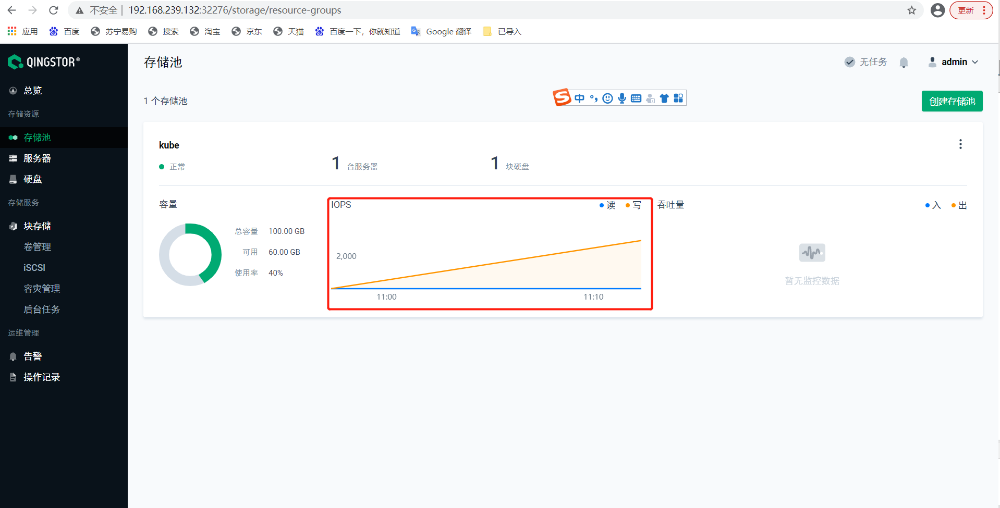


# 卸载
1. 查看已经安装的neonio：
    
    `helm list -A`

    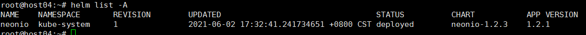 

2. 卸载neonio：
    
    `helm uninstall neonio --namespace kube-system`

3. 确认相关neonio pod和storageclass均已被删除,以下命令输出为空

    ```
    kubectl get pod -A | grep neon
    kubectl get storageclass | grep csi-neonsan
    ```

4. 登录到部署zookeeper、mysql的节点清除持久化的元数据

    `rm -rf /opt/neonsan/*`

5. 登录到部署store的节点清除store的配置

    `rm -rf /etc/neonsan/*`


# 故障排查

```
kubectl describe pod <application pod name>
kubectl describe pvc <pvc name>
kubectl get storageclass <storageclass name> -o yaml
kubect logs <neonsan csi pod name> -c <container name>
```


# 联系方式

我们可以使用 Matrix/slack。 那些想在网上找到我们的人可以通过以下方式加入我们：
- Matrix: <https://matrix.to/#/#neonio:matrix.org>
- Slack: <https://join.slack.com/t/qingstor/shared_invite/zt-quh57ig2-4Oegt91U4KaNz_ouxAI3yQ> (expire on 2021/26/06)   